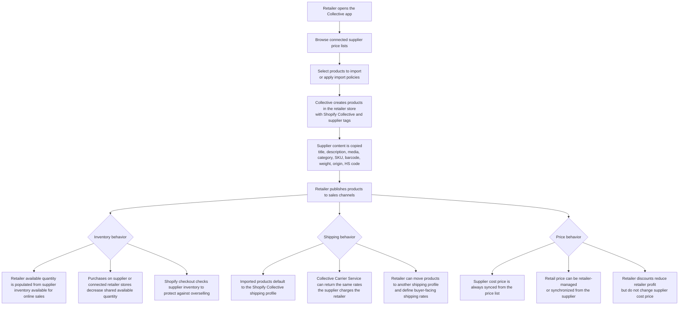
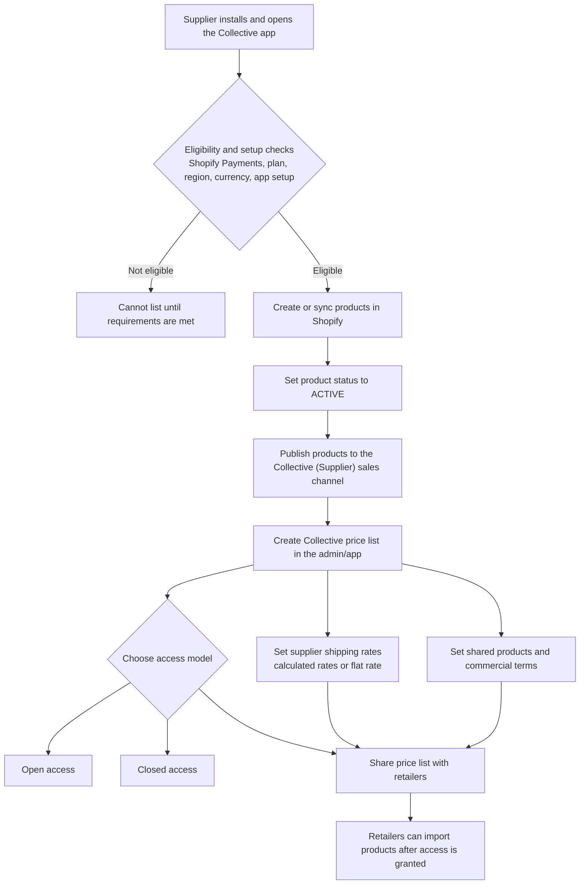
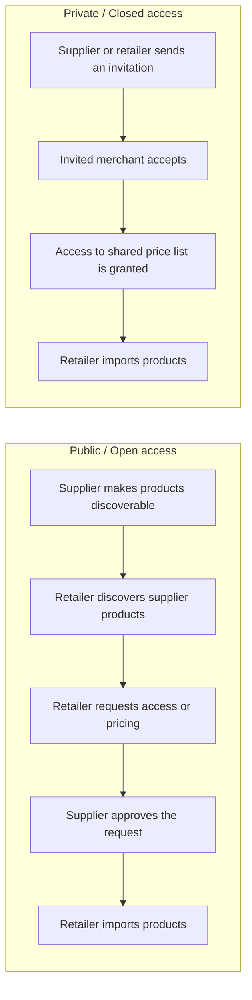
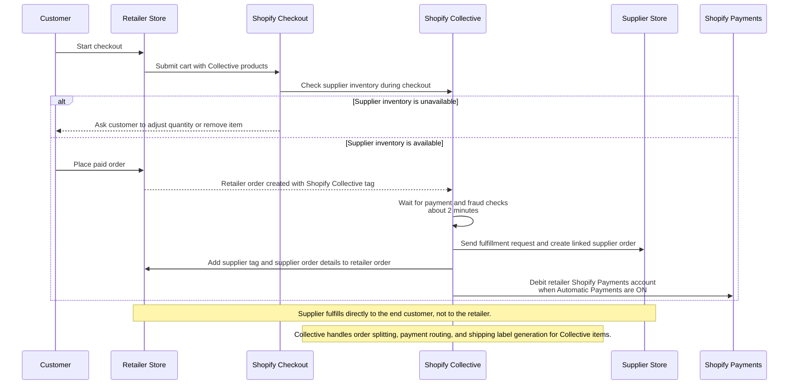
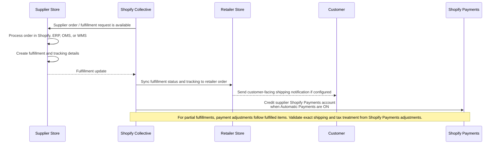
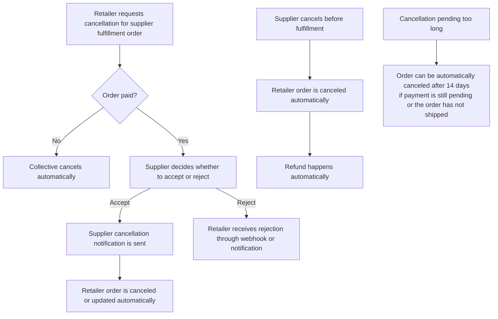
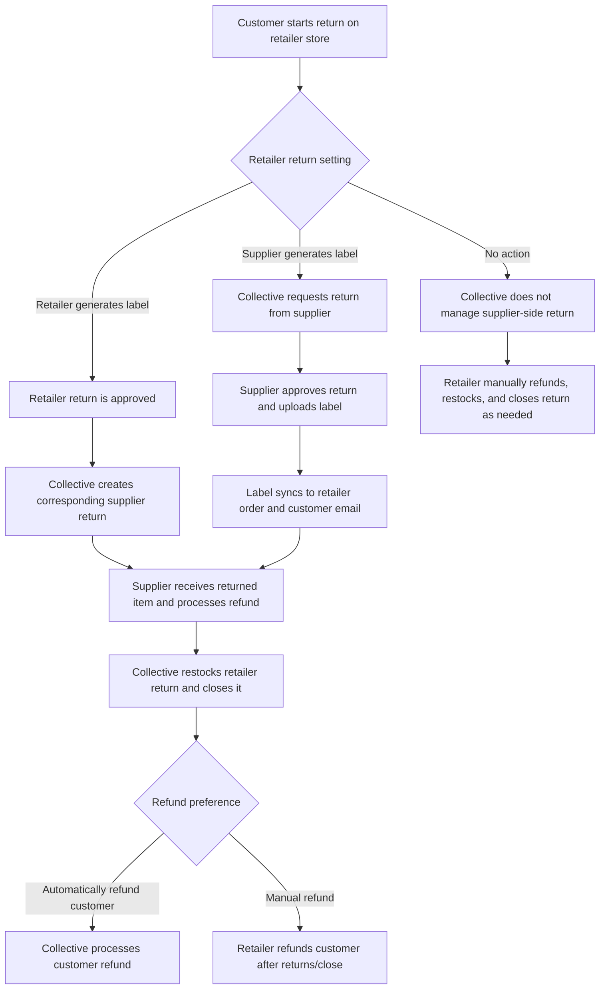
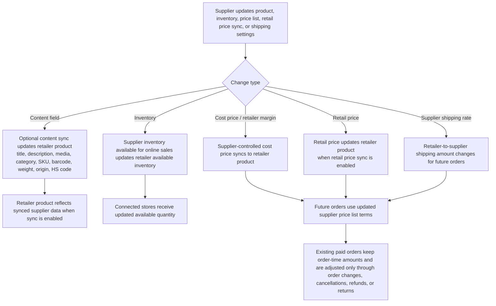
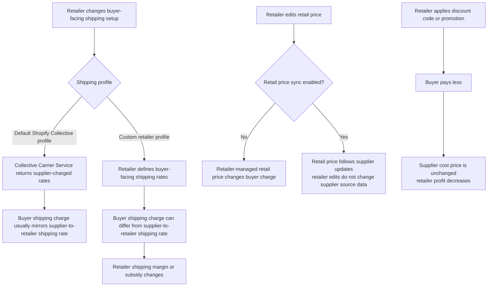

# Shopify Collective Flow Diagrams for Retailers and Suppliers

This document describes Shopify Collective at the merchant and integration workflow level. It focuses on product sharing, product import, inventory and shipping behavior, order routing, fulfillment, automatic payments, cancellations, returns, and pricing-related changes.

It does not describe Shopify internal implementation details. The diagrams combine the behavior documented on Shopify developer pages with merchant-visible behavior that can be validated in a store.

## Terms

- **Supplier:** The merchant that owns the source products, shares them through Shopify Collective, and fulfills orders directly to the end customer.
- **Retailer:** The merchant that imports supplier products, sells them on its storefront, and handles the customer relationship.
- **Price list / catalog:** The supplier-managed set of products and commercial terms shared with retailers. Price lists are managed in the Shopify admin or Collective app, not through public developer APIs.
- **Cost price:** The supplier-side amount the retailer owes the supplier for a product sold through Collective. It is derived from the supplier's retail price and the retailer margin set on the supplier price list, and it is continuously synced from the supplier.
- **Retail price:** The buyer-facing product price on the retailer store. Retailers can adjust it unless they choose to keep the supplier's retail price synchronized.
- **Open access:** A merchant-facing sharing model where retailers can discover supplier products and request access.
- **Closed access:** A merchant-facing sharing model where access is limited to invited or approved retailers.
- **Margin / profit:** The retailer's retained economics after the supplier-side cost price, supplier shipping, tax, discounts, and payment adjustments are accounted for. Exact amounts should be validated from order and Shopify Payments adjustment records.
- **Automatic payments:** Collective can debit the retailer's Shopify Payments account and credit the supplier's Shopify Payments account when Automatic Payments are enabled.

## 1. Retailer Product Import and Publication

Retailers import products from supplier price lists using the Collective (Retailer) app. Imported products are created in the retailer store, tagged for identification, and can be published to the retailer's sales channels.

Notes:

- Inventory sync is continuous across connected stores, and the checkout-level supplier inventory check is the protection that matters during high-volume sales. This protection applies to Shopify checkout, not manual order insertion. Help Center guidance also notes that average syncing time is less than 30 seconds but can take up to 5 minutes.
- Product content can optionally stay in sync with the supplier. The documented copied fields include title, description, media, category, compare-at price, product type, SKU, barcode, weight, country or region of origin, and HS code. Collections, tags, discount codes, and custom metafields are not imported from the supplier.
- Retailer integrations that need to mirror imported Collective products into an ERP, PIM, OMS, or other external system should subscribe to product creation, update, and deletion webhooks.
- Retailers can customize what buyers pay for shipping. Supplier-defined shipping rates determine what the retailer pays the supplier for fulfillment to the end customer.
- Supplier cost price is controlled through the Collective price list. Retailers can choose their buyer-facing retail price and can apply discounts, but those changes affect retailer profit rather than the supplier cost price.

## 2. Supplier Listing Flow

Suppliers publish products to the Collective (Supplier) channel, create price lists, configure shipping rates, and share access with retailers.

Notes:

- If a supplier uses an ERP, PIM, or other source of truth, the integration can create and update products through the Admin API, publish them to the Collective (Supplier) publication, and then the merchant creates and shares price lists through the Collective UI.
- Collective price lists are not created through public developer APIs.
- Supplier shipping rates are what retailers pay suppliers for fulfilling orders to end customers. Buyer-facing shipping rates are controlled on the retailer store.

## 3. Retailer and Supplier Connection Models

Retailers and suppliers must connect before products can be shared and imported. Invitations and connection management are handled through the Collective apps.

Notes:

- Developer docs state that invitations must be sent and accepted through the Collective apps; there are no public developer APIs for sending or accepting Collective invitations.
- Open access and closed access are merchant-facing access patterns. For integration docs, treat the established connection and shared price list as the system boundary.

## 4. Retailer Order Flow

When a customer buys a Collective product on the retailer store, the order is created on the retailer store first. After payment and fraud checks, Collective sends a fulfillment request to the supplier and links the retailer fulfillment order with the supplier order.

Order identification:

- Retailer-side orders containing Collective products have the `Shopify Collective` tag. After the supplier order is created, the retailer order can also have a `{$supplier_name}` tag.
- Supplier-side orders created by Collective have the `Shopify Collective` and `{$retailer_name}` tags.
- The linked supplier order number and associated shipping cost can appear in the order's additional notes or custom details.
- Retailer integrations should identify Collective line items and track supplier fulfillment status. Supplier integrations should receive and fulfill orders tagged with `Shopify Collective` and the retailer name.
- Retailer and supplier integrations that sync Collective orders to an ERP, OMS, WMS, or finance system should listen to order creation and order update webhooks on the relevant store.

Payment notes:

- If Automatic Payments are enabled, marking an order as paid can trigger a debit operation on the retailer's Shopify Payments account for funds needed to pay suppliers.
- Suppliers are paid after they fulfill the order on their side.
- If an order includes Collective and non-Collective items, the retailer continues to handle non-Collective items through its normal fulfillment process.

## 5. Supplier Fulfillment and Payout Flow

Suppliers receive the linked order or fulfillment request, fulfill the item, and provide fulfillment or tracking updates. Collective syncs fulfillment status back to the retailer order and credits the supplier when Automatic Payments are enabled.

Notes:

- Suppliers fulfill directly to the end customer.
- The supplier can create fulfillment and tracking updates through the Admin API when fulfillment is driven from an external backend.
- Retailer integrations can read the order fulfillment state through the Admin API when they need on-demand reconciliation in addition to webhook-driven updates.
- Inventory quantity is decreased when buyers purchase the product on the supplier store or connected retailer stores. Fulfillment confirms shipping and payout flow, but inventory availability is already coordinated through Collective inventory sync and checkout checks.

## 6. Cancellations, Refunds, and Returns

Cancellations and returns work differently depending on whether the order has been paid, whether it has been fulfilled, and which return handling option the retailer selected.

### Cancellation Flow

Notes:

- Retailers can request cancellation using the fulfillment order cancellation request flow.
- If the order is not yet paid, Collective cancels automatically.
- If the order is paid, the supplier can decide whether to cancel.
- A supplier can cancel before fulfilling; when this happens, the retailer order is canceled and the refund happens automatically.

### Return Handling Options

Notes:

- Retailers receive return-related webhook notifications for events such as return approval, return request, reverse fulfillment disposition, return close, and refund creation, depending on the flow.
- When automatic customer refunds are enabled for the selected return flow, Collective can process the refund for returned items.
- If automatic refunds are not enabled, the retailer handles customer refunds after the return closes.
- Financial reversals for supplier and retailer payments should be validated from Shopify Payments adjustments and refund records because the exact amount depends on item, shipping, tax, payment state, and return/refund settings.

## 7. Supplier Price, Product, Inventory, or Shipping Changes

Supplier-side changes can affect imported products, future orders, retailer economics, and supplier settlement.

Notes:

- Supplier inventory is the source used to populate available inventory on retailer stores.
- Supplier cost price is always synced to the retailer store and the retailer cannot edit it.
- Retail price sync is off by default in the merchant-facing Collective app, and retailers can adjust retail price when they manage it themselves. If retail price sync is enabled, the retailer product follows supplier retail price updates.
- Supplier shipping rates determine what the retailer pays the supplier for fulfilling the order to the end customer.
- If supplier cost or shipping increases while buyer-facing charges do not increase equivalently, retailer retained margin can decrease. If supplier cost or shipping decreases, retailer retained margin can increase.

## 8. Retailer Buyer-Facing Shipping, Retail Price, and Discount Changes

Retailers can customize what buyers pay for shipping, can adjust buyer-facing retail price when they do not synchronize it from the supplier, and can apply discounts. These changes affect the retailer's profit, but they do not change the supplier cost price.

Notes:

- There are two shipping rates to model separately: what the retailer charges the buyer, and what the supplier charges the retailer.
- Moving Collective products to a retailer-managed shipping profile lets the retailer define buyer-facing rates.
- Supplier cost price should be treated as supplier-synced through the Collective price list. Retailer profit changes should be modeled through cost price, buyer-facing retail price, discounts, shipping, refunds, taxes, and payment adjustments.

## FAQ

### When is order data created in the supplier store?

The retailer order is created first. After the order is paid, Shopify Collective waits about 2 minutes for fraud checks. If the order is not on hold, Collective sends the fulfillment request to the supplier, links the retailer fulfillment order with the supplier order, and the supplier sees the order in the supplier Shopify admin. If the retailer or supplier syncs orders to an ERP, OMS, WMS, or other external system, that external sync should be driven from order creation and order update webhooks on the relevant store.

### How is the supplier order amount determined?

The supplier-side amount is not the customer's full checkout total. It is based on the supplier-side cost price for the sold products, the supplier shipping cost charged to the retailer, and any applicable taxes or order/payment adjustments. Cost price is determined by the supplier price list, usually from the product retail price minus the retailer margin. The exact amount should be validated from the supplier order, retailer order additional notes or custom details, and Shopify Payments adjustment records. External finance or ERP systems should treat order webhooks as the change feed, then reconcile final money movement against payment adjustment records.

### How is inventory synchronized between supplier and retailer?

When a supplier shares a product through a Collective price list, the supplier's inventory available for online sales is used to populate available inventory in the retailer store. Purchases on the supplier store or connected retailer stores decrease the shared available quantity, and the change is propagated to connected stores. Shopify checkout also checks supplier inventory during checkout to protect against overselling. If an external system needs to mirror imported product or inventory changes from the retailer store, it should subscribe to product creation, update, and deletion webhooks.

### Can supplier and retailer inventory quantities diverge?

Yes, temporary divergence can happen while inventory updates propagate, especially during high-volume sales. Merchant documentation states that average syncing time is less than 30 seconds but can take up to 5 minutes. Shopify checkout checks supplier inventory before completing a sale, but that protection does not apply to manual order insertion. Divergence or broken sync can also occur if the Collective inventory location is changed, if product access is removed, or if POS-only inventory assumptions are used because POS inventory levels are not synced to retailers.

### Must product master data always be registered on the supplier side?

For Shopify Collective sharing, the product must exist in the supplier Shopify store, be active, be published to the Collective (Supplier) sales channel, and be added to a Collective price list. The operational source of truth can still be an ERP, PIM, or another external system, as long as that system syncs the product into Shopify before the supplier shares it through Collective. External source systems should use normal Shopify product integration patterns to keep the supplier store updated; after products are imported on the retailer side, downstream retailer systems can use product creation, update, and deletion webhooks.

### What happens to retailer data if the supplier changes product data, price, or inventory?

Inventory and cost price are continuously synced from the supplier to retailer stores. Retail price sync is controlled separately: retailers can manage retail price themselves, or they can enable retail price syncing from the supplier. Other product details, such as title, description, media, and category, can be copied and optionally kept in sync depending on product policy and sync settings. Retailer-side integrations that need to mirror these changes to an external system should listen to product creation, update, and deletion webhooks.

### What happens to supplier data if the retailer changes product data, price, or inventory?

Retailer-side edits do not update the supplier's source product. Retailers can edit certain buyer-facing product details such as retail price, title, description, and media, but supplier-managed fields remain controlled by the supplier. Inventory quantities for imported Collective products are managed by the supplier and are read-only in the retailer admin. Retailer edits to synced or supplier-controlled fields can be overwritten when the supplier updates the original product or can break expected sync behavior if the Collective inventory location or product connection is changed. External systems connected to the retailer store should treat product webhooks as retailer-store updates, not as evidence that supplier master data changed.

### What happens to the supplier order amount if the retailer configures a discount?

Retailer discounts change what the customer pays and reduce the retailer's profit, but they do not change the supplier cost price for the item. For example, if a product has a retail price of 100 USD and a supplier cost price of 70 USD, a 20 USD customer discount reduces the retailer's profit but the retailer still owes the supplier 70 USD for the product. Shipping, taxes, refunds, returns, and payment adjustments still need to be reconciled separately.

### For orders paid with Shopify Payments, does the amount deposited to the supplier match the supplier order amount?

Not always as a one-to-one bank deposit. When Automatic Payments are enabled, Collective debits the retailer's Shopify Payments balance and credits the supplier's Shopify Payments balance after the supplier fulfills the order. The supplier can view transferred amounts for product and shipping on Collective payment records, and integrations can inspect Shopify Payments balance adjustment records for the associated order. However, payouts can aggregate multiple payments and can be affected by refunds, returns, cancellations, reversals, taxes, shipping, partial fulfillment, payment timing, insufficient funds, and Shopify Payments balance behavior. Use the supplier order plus the payment adjustment records as the reconciliation source. External finance systems should combine order webhooks, return/refund webhooks, and payment adjustment reconciliation rather than relying on a single payout deposit.

## References

- [About Shopify Collective](https://shopify.dev/docs/apps/build/collective)
- [Share and import products](https://shopify.dev/docs/apps/build/collective/products)
- [Define shipping rates](https://shopify.dev/docs/apps/build/collective/shipping)
- [Request and accept fulfillment orders](https://shopify.dev/docs/apps/build/collective/orders)
- [Cancel orders](https://shopify.dev/docs/apps/build/collective/cancellations)
- [Handle returns](https://shopify.dev/docs/apps/build/collective/returns)
- [Build an ERP integration for Shopify Collective](https://shopify.dev/docs/apps/build/collective/erp-integration-tutorial)
- [Shopify Collective Help Center overview](https://help.shopify.com/en/manual/online-sales-channels/shopify-collective/index)
- [Shopify Collective for suppliers](https://help.shopify.com/en/manual/online-sales-channels/shopify-collective/suppliers/index)
- [Setting up and managing price lists on the Shopify Collective sales channel](https://help.shopify.com/en/manual/online-sales-channels/shopify-collective/suppliers/price-lists)
- [Getting paid on the Shopify Collective sales channel](https://help.shopify.com/en/manual/online-sales-channels/shopify-collective/suppliers/payments)
- [Shopify Collective for retailers](https://help.shopify.com/en/manual/online-sales-channels/shopify-collective/retailers/index)
- [Managing products in the Shopify Collective app](https://help.shopify.com/en/manual/online-sales-channels/shopify-collective/retailers/importing-products)
- [Paying your suppliers in the Shopify Collective app](https://help.shopify.com/en/manual/online-sales-channels/shopify-collective/retailers/payments)
- [Requirements and considerations for using the Shopify Collective app](https://help.shopify.com/en/manual/online-sales-channels/shopify-collective/retailers/requirements-and-considerations)
