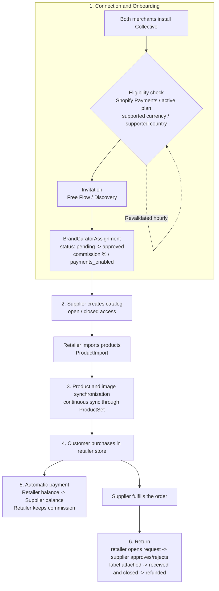
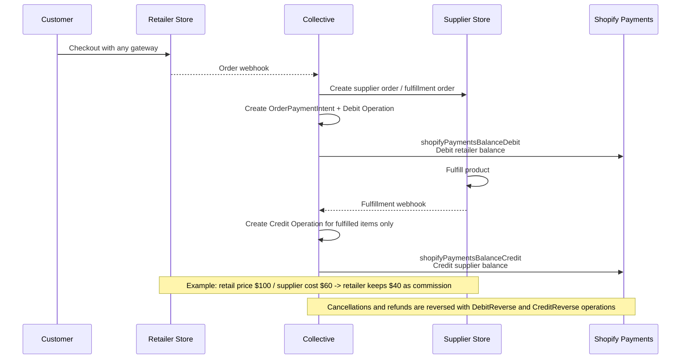
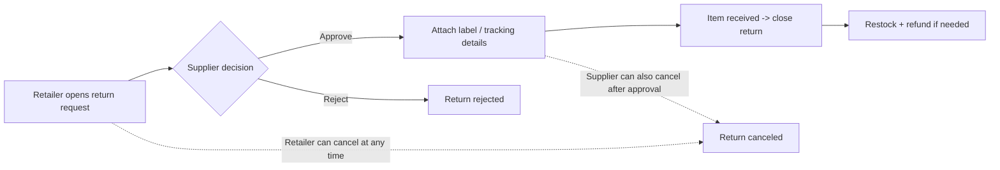

# Shopify Collective Architecture

This document summarizes the main Shopify Collective flows: connection and onboarding, product sharing and synchronization, order routing, automatic payments, fulfillment, and returns.

## 1. End-to-End Flow

The end-to-end architecture starts when both merchants install Shopify Collective and pass recurring eligibility checks. The supplier then shares products through a catalog, the retailer imports those products, Collective keeps product data synchronized, and customer orders are routed to the supplier for fulfillment. Automatic payments move supplier revenue from the retailer's Shopify Payments balance to the supplier's Shopify Payments balance while the retailer keeps the commission.

## 2. Order, Fulfillment, and Automatic Payment Flow

When a customer purchases a Collective product from the retailer, Collective receives the order event, creates the supplier-side order and fulfillment order, and creates the payment intent and debit operation. Supplier payout is credited after fulfillment, so payment settlement follows the fulfilled quantity rather than only the original order.

## 3. Returns State Flow

Returns are initiated by the retailer and reviewed by the supplier. If approved, the supplier attaches return label or tracking details, receives the item, closes the return, and restocks or refunds as needed. The retailer can cancel the return at any time, and the supplier can also cancel after approval.

## Key Integration Concepts

- **Supplier:** The merchant that owns the source products, shares them through Collective, and fulfills routed orders.
- **Retailer:** The merchant that imports supplier products, sells them on its storefront, and keeps the configured commission.
- **Catalog / price list:** The supplier-controlled product sharing surface that determines which products a retailer can import and sell.
- **Product import and sync:** The retailer-side product record is created from the supplier's shared product data and kept synchronized for product, image, and inventory changes.
- **Automatic payments:** Collective coordinates debit and credit operations through Shopify Payments so the supplier receives the supplier cost and the retailer keeps the margin.
- **Returns:** The retailer initiates the return request, while the supplier decides whether to approve it and handles receiving and closure.

## References

- [About Shopify Collective](https://shopify.dev/docs/apps/build/collective)
- [Share and import products](https://shopify.dev/docs/apps/build/collective/products)
- [Request and accept fulfillment orders](https://shopify.dev/docs/apps/build/collective/orders)
